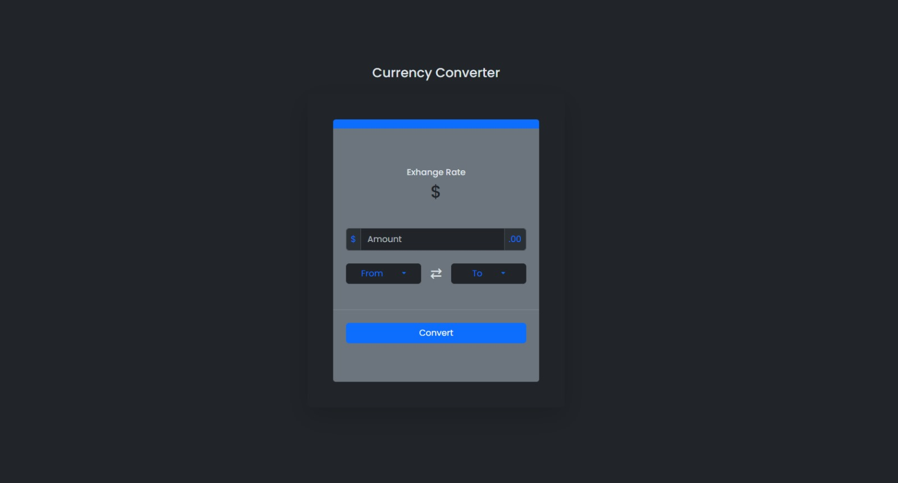
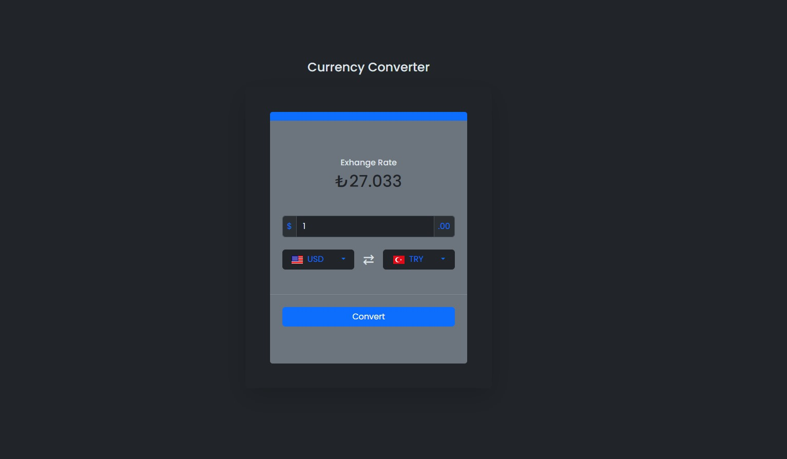

## Table of contents

- [Overview](#overview)
  - [The challenge](#the-challenge)
  - [Screenshot](#screenshot)
  - [Links](#links)
- [My process](#my-process)
  - [Built with](#built-with)
  - [What I learned](#what-i-learned)
  

## Overview

### The challenge

Users should be able to:

- The currencies users choose are converted to each other according to the amount they enter.

### Screenshot

### Links

- Solution URL: [Add solution URL here]
- Live Site URL: [https://mean-stretch.surge.sh/]

## My process

### Built with

- Semantic HTML5 markup
- CSS custom properties
- Bootstrap v5.3
- Vanilla JavaScript - (Promise, fetch)

### What I learned

While developing the Currency Converter application, I implemented and improved the following items:

1. HTML & CSS & Bootstrap Basics:
    - Creating jobs to be done with HTML tags.
    - Implementation of visual style (design) with Bootstrap & CSS.

2. DOM Manipulation (Document Object Model):
    - Select, change and manipulate HTML DOM elements using JavaScript.

3. Event Listeners:
    - Using event listeners to listen and react to user interactions (clicks).
  
4. Functions and Conditional Statements:
    - Creating and using JavaScript functions.
    - Using conditional statements (if, else if, else).

5. ES6 properties:
    - Using Class Structures
    - Promise, fetch

6. Organization:
    - Dividing the project into modules according to their operations (ui.js, currency.js(api operations), project.js etc.)

These items cover the major issues I encountered while developing this basic currency converter app. While developing the application, I had the opportunity to understand, reinforce and apply these topics and helped me improve my JavaScript, HTML and CSS skills more. I made this project to improve my asynchronous programming skills by pulling data from API and using promise and fetch in Javascript.

